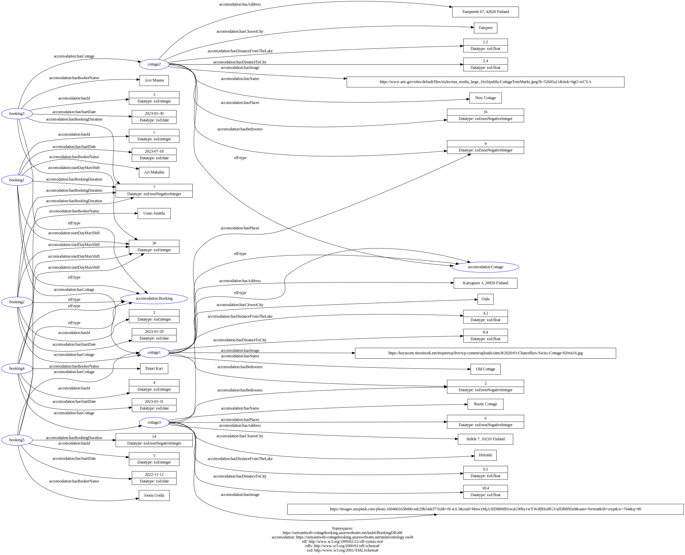
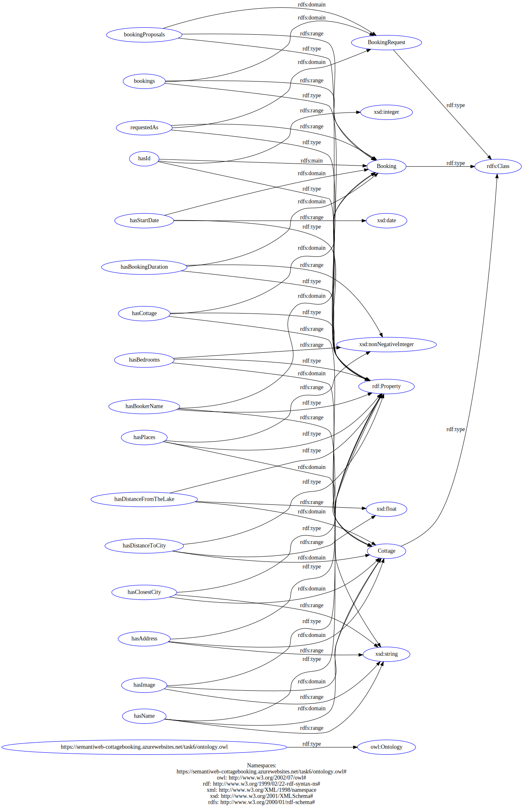

# Project for Task 6, 7 and 8.

This a project for the group work for course [TIES4520](http://users.jyu.fi/~olkhriye/ties4520/) at University of Jyväskylä, Finland (JYU).
Project domain is a cottage booking service, which is using Apache Jena database and Apache Jena Fuseki sparql endpoint.

The project is deployed to [Azure App Services](https://semantiweb-cottagebooking.azurewebsites.net/task6/) until the course ends.

